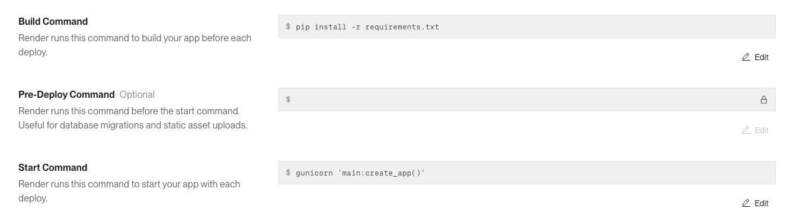

# Project Cost Tracking API Server

## About the project
This project is for setting up and recording project costs during project delivery phase. Based on that, Project Manager can keep track of costs at any time during project delivery. 

The database contains 5 tables:
- projects: main information of projects
- staffs: information of staffs in the company
- project_personnel: information of project staffs
- suppliers: information of suppliers
- project_costs: information of the costs incurred throughout the projects

Features:
- Get all data in each table
- Get a specific data in each table by data id
- Filter data by specific criteria:
  - projects table: Filter projects by specific "location"
  - staffs table: Filter staffs by specific "role"
  - project_personnel table: Filter personnel by "project_id"
  - suppliers table: Filter suppliers by "name"
  - project_costs: Filter costs by "date"
- Update data in tables 
- Add new data to tables
- Delete data in tables

The database is deployed using Neon.

The API is deployed using Render, with following settings:

### How to use

First, click https://insomnia.rest/ to dowload and get instructions on using Insomnia 

Accessing the Web services using link: https://project-cost-tracking-api.onrender.com/
You will receive a Welcome message. 

Now follow these below routes to access and maipulate datas in database tables:

- View all data in table: https://project-cost-tracking-api.onrender.com/"table name"
- View individual project data by id: https://project-cost-tracking-api.onrender.com/"table name/"table id"
- Filter data by a specific criteria: https://project-cost-tracking-api.onrender.com/"table name"?"filter column name"="criteria"

For example, filtering projects by "location" is "Sydney" in projects table using this route:
https://project-cost-tracking-api.onrender.com/projects?location=Sydney
- Add new data using Insomnia with POST request on route: https://project-cost-tracking-api.onrender.com/"table name"
- Update a specific data in table using Insomnia with PUT/PATCH request on route: https://project-cost-tracking-api.onrender.com/"table name"/"data id" 

"data id" is id of each data in table
- Add new data using Insomnia with POST request on route: https://project-cost-tracking-api.onrender.com/"table name"/"data id"
"data id" is id of each data in table

**Note**: 
- Please make sure date data always in format: "YYYY-MM-DD"
- Please ensure that you follow below data constraints in each table to avoid errors

| Table name | Data & Constraints| 
|:---------|:--------:|
| projects   | "name", "location", "client" : text, name must be unique and not be null  | 
|             | "start_date","estimate_complete_date" : Date   | 
|             | "contract_value", "budget" : number, must not be null, budget must be lower than contract_value  | 
|  | "status" : must be "Active" or "Closed"  | 
| staffs | "name", "role": text, name must not be null | 
|         | "email": email type, must be unique and not null  | 
| project_personnel | "project_role": text| 
| suppliers | "abn", "name", "sector", "address": text, name must not be null | 
|  | "email": email type, must be unique | 
| project_costs | "date": date type, must not be null | 
|  | "invoice_no", "description": text, description must not be null  | 
|  | "value": number, must not be null  | 

  - All numbers must be positive
  - All text must have more than 2 characters
  - All "id" is default generated number.
  - All date must be in format: "YYYY-MM-DD"
  - All email must be in email format "abc@def.gkh

## Feedbacks 

### Feedback 1
Feedback received by Aamod on below initial diagram:
- There's a one to many relationship from projects to "incurred costs", and also from the junction table "cost_allocation" to "incurred costs". Maybe avoid the junction table connection. If you do plan to keep the connection:
  
- Have a separate PK in the junction tableIt works as a FK in the "incurred costs" table.

- The concept of "Incurred costs" and "Cost Allocation" seems redundant.
responsible_staff in "incurred costs" table, is it supposed to track staff? If so, a good idea is to create a staffs table and link it (normalisation would help here).

- You have "project manager" as well. So maybe project manager can link to "staffs" table?

- Because you have project start, completion dates, you could also add a "status" attribute to the "projects" table that has (active, completed, cancelled, or something similar).

**Actions**:
- Remove project_cost_summary, cost_allocation and cost_codes tables. The reasons are:
  - project_cost_summary data are calculated from project budget data and cost data, which are in projects and costs tables. Therefore, project_cost_summary table is redundant.  
  - cost allocation and cost_codes tables are not essential at this project development stage, therefore being removed. These will be considered to integrate in the next stage. 
- Data Normalisation:
  - Creating staffs table, and a conjunction table "project_personnel" connecting projects and staffs tables. 
  - Normalise costs table containing only direct relevant columns.

Ammended and normalised ERD is as below:

### Feedback 2
Feedback received by an external developer
- README file does not have information of how to perform POST, PUT/PATCH and DELETE request on the database
- No information on date format needs to use. 

**Actions**:
- Add instruction of performing POST, PUT/PATCH and DELETE requests with Insomnia
- Add instructions on date format and other data constraints in each table, so that the users can follow to avoid errors. 
